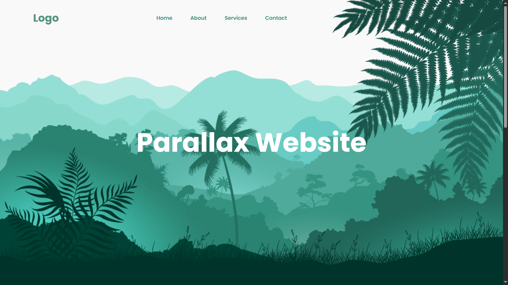
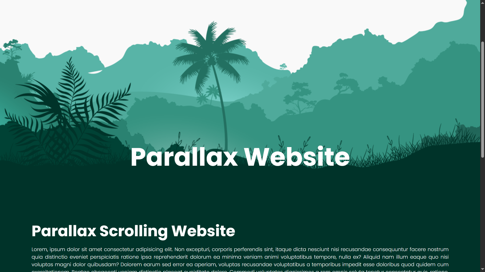
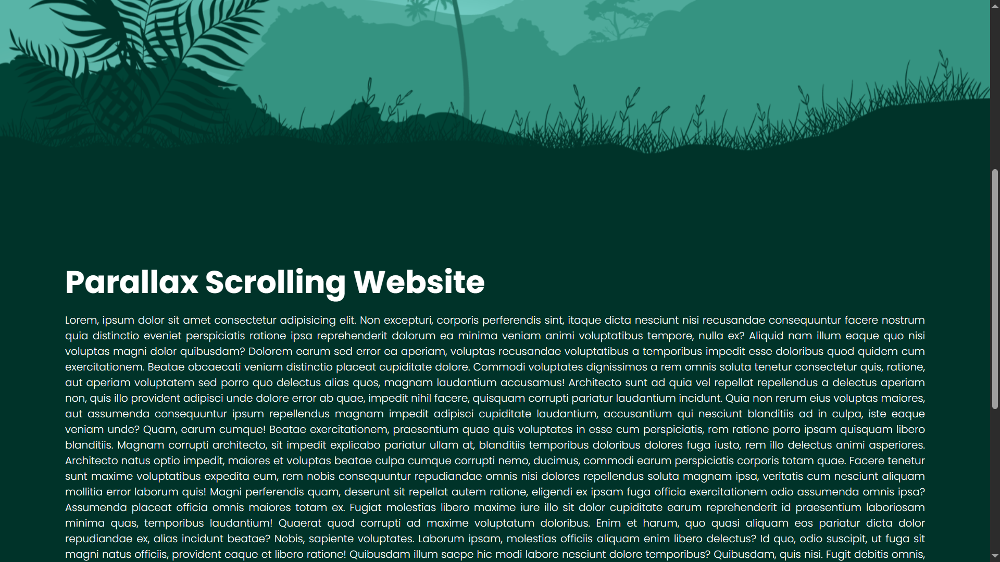

# 🌟 Parallax Effect with JavaScript 🌟

A simple and elegant **Parallax Scrolling Effect** built with **HTML**, **CSS**, and **JavaScript**. This effect creates a stunning illusion of depth by having background images and text move at different speeds as the user scrolls.

## 🚀 Features
- Parallax effect on background images and text.
- Smooth scrolling transitions.
- Fully responsive design.
- Built with **HTML**, **CSS**, and **JavaScript**.
- Lightweight and easy to integrate into any project.

## 📸 Demo





## 🛠 Technologies Used
- **HTML5**
- **CSS3**
- **JavaScript (ES6)**
- **Google Fonts (Poppins)**


## 💻 Installation

Clone the repository:
   ```bash
   git clone https://github.com/Khairul25556/website-parallax-effect-with-JS.git
